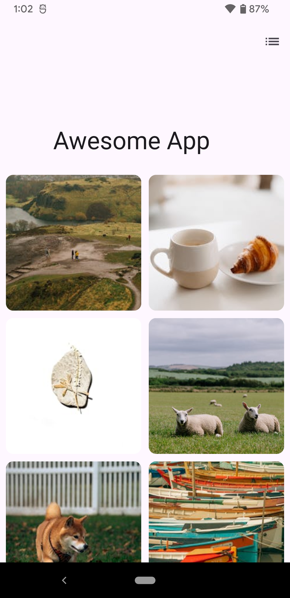
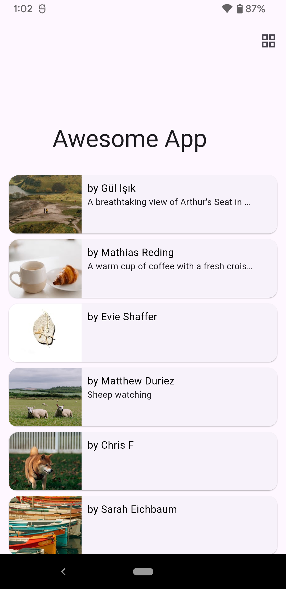
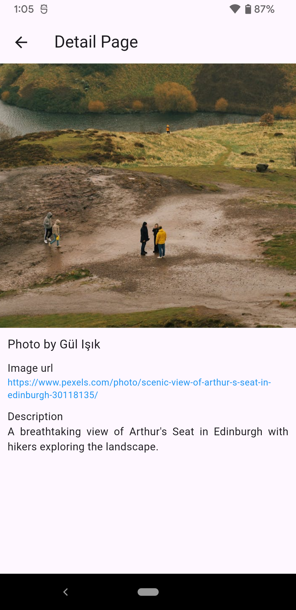

# Awesome App

  
  
  

## Overview

Awesome App is a Flutter-based mobile application that fetches and displays randomized images and descriptions from the Pexels API or any other similar open-source/free API. The app aims to provide an engaging and responsive experience for browsing images with a variety of features and functionality.

## Features

- Dynamic List Style: Users can toggle between grid view and list view using an icon in the AppBar.
- Infinite Scrolling: Automatically loads more images as the user scrolls down.
- Detail Page: Each item is tappable and navigates to a detail page displaying:
  * Larger version of the image
  * Photographer’s name
  * Photo URL
  * Additional optional details about the image

## Technical Specifications

-  Framework: Flutter
-  State Management: BLoC.
